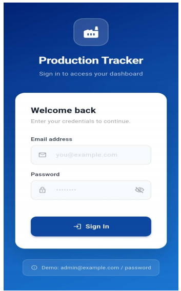
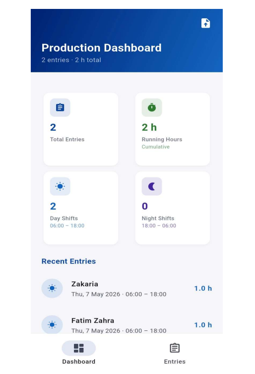
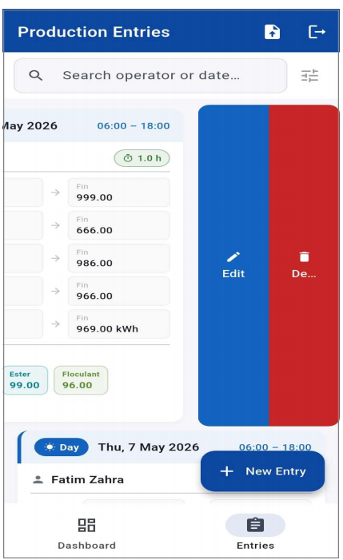

# Production Tracker

A cross-platform Flutter application designed to track and manage production activities efficiently. The application enables users to record production data, manage entries, and monitor productivity through an intuitive and user-friendly interface.

---

## Features

- 🔐 Secure user authentication
- 📋 Production entry management
- 📊 Dashboard with production statistics
- 💾 Local SQLite database
- 📱 Responsive and modern UI
- 🌐 Cross-platform support (Android, Windows, Web)

---

## Technologies Used

- Flutter
- Dart
- SQLite
- Provider (State Management)

---

## Project Structure

```text
lib/
├── models/
├── providers/
├── screens/
├── services/
├── widgets/
└── main.dart
```

---

## Screenshots

### Login Screen



### Dashboard



### Production Entries



---

## Getting Started

### Clone the repository

```bash
git clone https://github.com/far34W/production-tracker.git
```

### Navigate to the project

```bash
cd production-tracker
```

### Install dependencies

```bash
flutter pub get
```

### Run the application

```bash
flutter run
```

---

## Author

**Zakaria Fartat**

Full Stack & Flutter Developer
